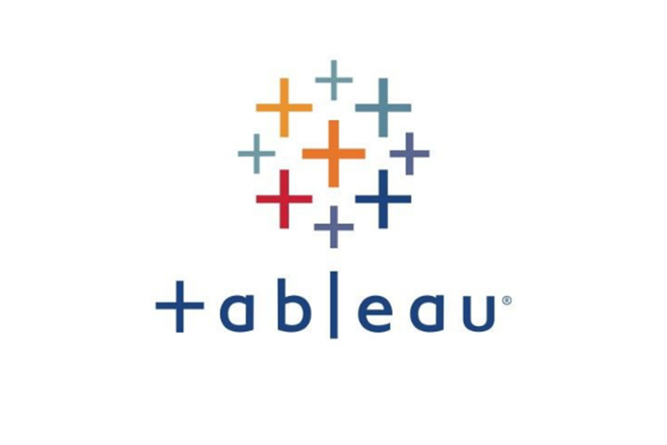
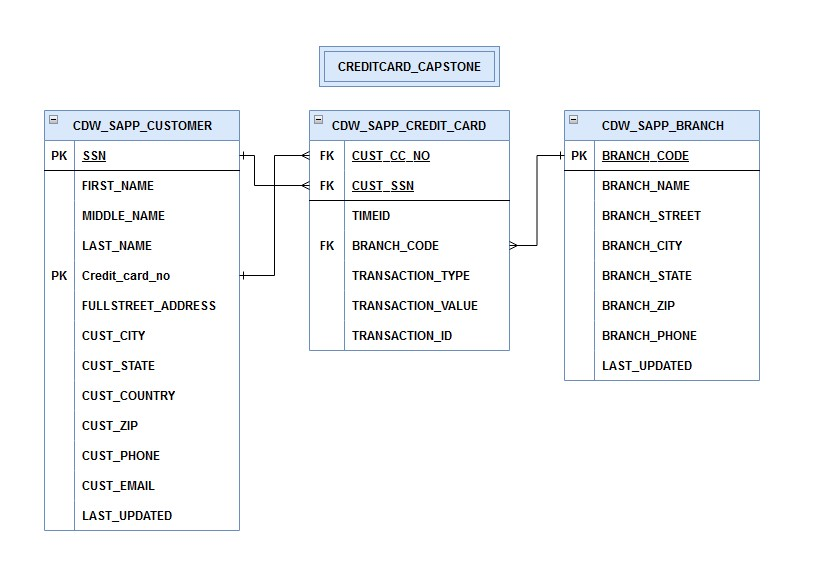
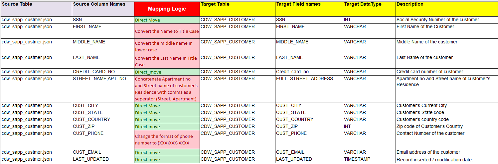

# **Capstone-Project**

This capstone project is the opportunity to demonstrate my knowledge and abilities you have acquired throughout Data-Engineering Cohort through using ETL process, Data Transactions, Data Analysis and Visualization using all the tools and technologies I have learned. 

## Description:

Capstone Project requiresto work with the following technologies to manage an ETL process for a Loan Application dataset and a Credit Card dataset: Python (Pandas, advanced modules, e.g., Matplotlib), SQL, Apache Spark (Spark Core, Spark SQL), and Python Visualization and Analytics libraries.I set up all the required environments and perform installations on local machines.

## Buit With:

-  VS Code
-  Windows 11
-  Python
-  Pandas
-  Numpy
-  Apache Spark
-  Matplotlib
-  SQL / MySQL
-  Tableu
-  REST API

## Workflow Diagram of the Requirements:

## Dataset Overview

The Credit Card System database is an independent system developed for managing activities such as registering new customers and approving or canceling requests, etc., using the architecture.
A credit card is issued to users to enact the payment system. It allows the cardholder to access financial services in exchange for the holder's promise to pay for them later. Below are three files that contain the customer’s transaction information and inventories in the credit card information.
- 	CDW_SAPP_CUSTOMER.JSON: This file has the existing customer details.
-	CDW_SAPP_CREDITCARD.JSON: This file contains all credit card transaction information.
-	CDW_SAPP_BRANCH.JSON: Each branch’s information and details are recorded in this file. 

## Transformed Data Model:

## Business Requirements:

1. Data Extraction and Transformation with Python and PySpark
2. Data loading into Database using RDBMS connection from PySPark to MySQL.
3. Functional Requirements to display Transaction Details Module on console-based Python program.
4. Functional Requirements to display Customer Details on console-based Python program.
5. Data Analysis and Visualization on transformed datasets using MatPlotLib, Seaborne or Tableau.
6. Access to Loan API Endpoint using requests module.
7. Data Analysis and Visualization on aquired data. 

## Mapping Requirements:

## Installation and Execution:

- Initially requires to run ExtractTransformLoad.py to perform ETL process on input files. This will provide Transformed CSV files.
- Transformed files were stored as JSON in this example to better performance during project presentation.
- Input files can be changed to CSV files in branchfile, creditfile and customerfile folders with small changes in the code. 
- Secondly, DataTranscation file is console base application for all the requirements provided in the project for Data Analysis. 
- Data Visualization is jupyter notebook file for visualizing graphs according the requirements. 
- LoanApplicationAPI is loan application data using rest API to fetch dataset and performing all Transformation and Visualization.

## Author:

- [Sanjay Patel](https://github.com/sanjaypatel16/)

