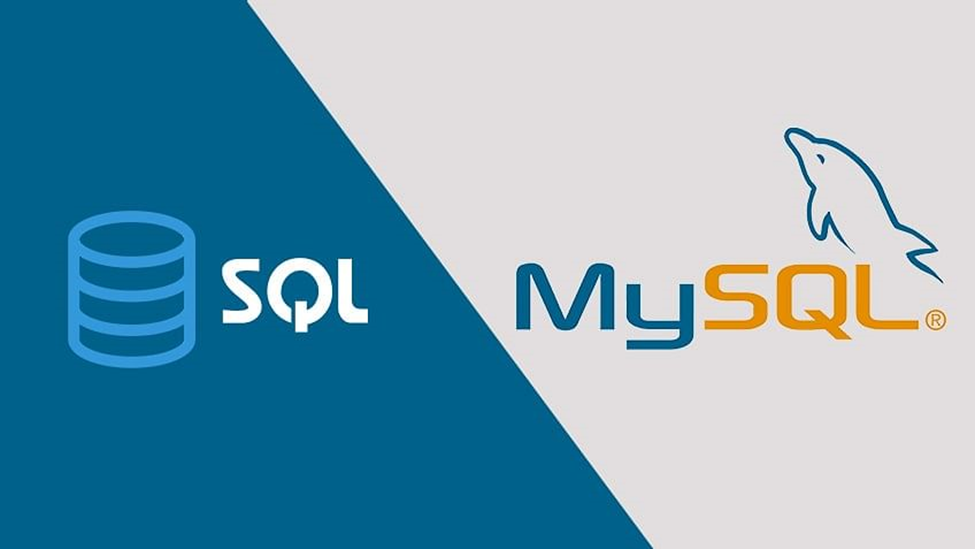

# **Capstone-Project**

This capstone project is the opportunity to demonstrate my knowledge and abilities you have acquired throughout Data-Engineering Cohort through using ETL process, Data Transactions, Data Analysis and Visualization using all the tools and technologies I have learned. 

## Description:

Capstone Project requiresto work with the following technologies to manage an ETL process for a Loan Application dataset and a Credit Card dataset: Python (Pandas, advanced modules, e.g., Matplotlib), SQL, Apache Spark (Spark Core, Spark SQL), and Python Visualization and Analytics libraries.I set up all the required environments and perform installations on local machines.

## Dependencies:

-  VS Code
-  Windows 11
-  Python
-  Pandas
-  Numpy
-  Apache Spark
-  Matplotlib
- 
- 

